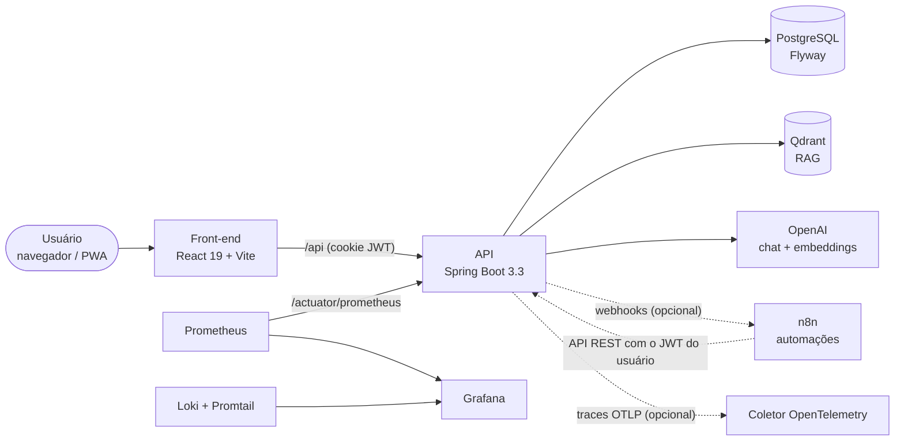

<div align="center">


# Core 4 ERP

**Sistema de gestão financeira pessoal, com assistente de IA integrado.**
Contas, cartões, conciliação, investimentos, relatórios e a Áurea — uma assistente que consulta
e lança dados por conversa. Pré-projeto desenvolvido como Trabalho de Conclusão de Curso (TCC).

[](LICENSE)
[](core4erp/build.gradle)
[](core4erp/build.gradle)
[](front-end/package.json)
[](docker-compose.yml)
[](#-status-do-projeto)

[O que é](#-o-que-é) ·
[Funcionalidades](#-funcionalidades) ·
[Arquitetura](#-arquitetura) ·
[Como executar](#-como-executar) ·
[Status](#-status-do-projeto) ·
[Autores](#-autores)

</div>

---

> [!NOTE]
> **Este é um pré-projeto acadêmico (TCC).** É um protótipo funcional, construído para
> demonstrar arquitetura, usabilidade e integridade de dados — **não é um produto pronto para
> produção** e não é mantido como tal. Use por sua conta e risco. Forks e contribuições são
> bem-vindos. Veja o [status do projeto](#-status-do-projeto).

## ✨ O que é

- **Gestão financeira completa.** Contas a pagar e a receber, contas correntes, cartões de
  crédito com faturas, investimentos e assinaturas recorrentes — num só lugar.
- **Conciliação que fecha a conta.** Importe o extrato OFX do banco ou do cartão e vincule cada
  item a um lançamento existente, ou crie o lançamento ali mesmo.
- **Uma assistente que entende o seu dinheiro.** A Áurea (OpenAI via Spring AI) responde
  perguntas, lança contas, lê planilhas e extratos anexados e gera relatórios em Excel.
- **Relatórios e painéis.** DRE, fluxo de caixa, extrato, posição financeira e mais — em tela,
  Excel ou PDF. Dashboard geral e um painel de BI dedicado aos cartões.
- **Dados isolados e auditados.** Cada empresa (ou pessoa física) só enxerga os próprios dados,
  com perfis de acesso, permissões granulares e trilha de auditoria.
- **Instalável e observável.** PWA para celular e desktop; métricas Prometheus, painéis Grafana,
  logs com `requestId` e traces OpenTelemetry.

## 🧭 Funcionalidades

<table>
<tr>
<td valign="top" width="50%">

### 💰 Finanças

- Contas a pagar/receber com baixa, estorno e status
- Contas correntes com transferências entre contas
- Cartões de crédito: lançamentos, parcelamento e fechamento de fatura
- **Importação de lançamentos de cartão por planilha** (`.xlsx`/`.xls`)
- Conciliação bancária e de cartão por arquivo **OFX**
- Investimentos com transações e tipos configuráveis
- Assinaturas recorrentes (com vínculo opcional ao cartão)
- Categorias hierárquicas (até 2 níveis) e parceiros com consulta de CNPJ (BrasilAPI)
- Calendário de vencimentos e notificações

</td>
<td valign="top" width="50%">

### 🤖 Inteligência

- **Áurea**, assistente de chat com respostas em streaming (SSE)
- 48 ferramentas (*function calling*) para consultar, cadastrar e lançar dados
- Anexos no chat: `.xlsx`, `.xls`, `.csv`, `.ofx`, `.pdf`, `.md`
- Histórico de conversas persistido e auditoria das ações da IA
- Sugestão automática de categoria a partir da descrição
- RAG com Qdrant: resumos financeiros e documentos indexados por empresa
- Relatórios em Excel gerados a partir da conversa

</td>
</tr>
<tr>
<td valign="top">

### 📊 Operação

- Dashboard com filtro de período e saldo detalhado
- Dashboard de BI dos cartões (7 painéis)
- 8 relatórios em Excel (Apache POI) e JSON; exportação em PDF no front-end
- Busca global (paleta de comandos)
- PWA instalável, tema claro/escuro e Central de Ajuda
- Métricas Prometheus, painel Grafana do chat (uso, custo e latência), Loki/Promtail
- Traces OpenTelemetry via OTLP (opcional)

</td>
<td valign="top">

### 🔐 Segurança

- JWT (HS256) em cookie **HttpOnly**
- Bloqueio de login após tentativas falhas e redefinição de senha por e-mail
- Multi-tenancy por empresa — pessoa física recebe a própria empresa
- RBAC: perfis, permissões diretas e convites de operadores
- Rate limiting por IP (login, registro, upload) e por usuário (chat)
- Headers de segurança (HSTS, `X-Frame-Options`, `nosniff`, `Cache-Control`)
- Trilha de auditoria das alterações

</td>
</tr>
</table>

## 🏗️ Arquitetura



O n8n nunca acessa o banco do ERP: toda leitura e escrita passa pela API, com o JWT do usuário,
preservando permissões, isolamento por empresa e auditoria.

| Pasta | O que tem |
|---|---|
| [`core4erp/`](core4erp) | Backend Spring Boot (Java 17, Gradle). Um pacote por domínio (`conta`, `cartaoCredito`, `chat`, `relatorio`…), migrations Flyway em `src/main/resources/db/migration` e a configuração de monitoramento em `monitoring/` |
| [`front-end/`](front-end) | SPA React 19 + Vite 6 + Tailwind CSS 4, PWA, servida por nginx em produção |
| [`n8n/`](n8n) | Workflows do n8n (chat orquestrado, ingestão RAG, eventos), contratos de payload e guia de montagem |
| [`docs/`](docs) | Planos de engenharia e documentos de apoio |
| [`Skill/`](Skill) | Guias de revisão (segurança, JPA, arquitetura, API…) usados no desenvolvimento assistido por IA |

## 🚀 Como executar

### Pré-requisitos

| Ferramenta | Versão |
|---|---|
| Java (JDK) | 17 |
| Node.js | 20+ |
| PostgreSQL | 15+ |
| Qdrant | 1.18 (RAG — o backend cria a coleção na inicialização) |
| Docker + Compose v2 | opcional, para a stack em containers |

O Gradle vem pelo wrapper (`./gradlew`). O chat precisa de uma chave da OpenAI.

### Variáveis de ambiente

Os modelos estão em [`core4erp/.env.example`](core4erp/.env.example) (backend local),
[`.env.example`](.env.example) (Docker Compose) e [`front-end/.env.example`](front-end/.env.example).
O backend lê o `.env` do diretório onde é iniciado.

**Essenciais**

| Variável | Descrição | Padrão |
|---|---|---|
| `DB_URL` | JDBC URL do PostgreSQL | — |
| `DB_USERNAME` / `DB_PASSWORD` | Credenciais do banco | — |
| `SECRET_KEY` | Chave HMAC do JWT — mínimo 64 caracteres (`openssl rand -hex 64`) | — |
| `OPENAI_API_KEY` | Chave da OpenAI (chat, classificação e embeddings) | — |
| `CORS_ORIGINS` | Origens permitidas, separadas por vírgula; a primeira também é a base do link de redefinição de senha | `http://localhost:5173,http://localhost:3000` |

**Opcionais**

| Variável | Descrição | Padrão |
|---|---|---|
| `DB_POOL_SIZE` | Tamanho do pool HikariCP | `3` |
| `TOKEN_EXPIRATION` | Validade do JWT em ms | `604800000` (7 dias) |
| `OPENAI_MODEL` | Modelo do chat | `gpt-4o-mini` |
| `OPENAI_EMBEDDING_MODEL` | Modelo de embeddings do RAG | `text-embedding-3-small` |
| `QDRANT_HOST` / `QDRANT_PORT` | Endereço gRPC do Qdrant | `qdrant` / `6334` |
| `CHAT_ORQUESTRADOR` | `interno`, `shadow` (só admin) ou `n8n` | `interno` |
| `N8N_WEBHOOK_URL`, `N8N_EVENTOS_WEBHOOK_URL`, `N8N_AUREA_WEBHOOK_URL`, `N8N_WEBHOOK_SECRET` | Integração com o n8n (vazio = desligada) | — |
| `MAIL_ENABLED`, `MAIL_HOST`, `MAIL_PORT`, `MAIL_USERNAME`, `MAIL_PASSWORD`, `MAIL_FROM` | SMTP para redefinição de senha e convites | `MAIL_ENABLED=false` |
| `TRUSTED_PROXY` | Confia no `X-Forwarded-For` para o rate limit — só atrás de um proxy conhecido | `false` |
| `APP_ENV` | Ambiente, como tag nas métricas | `development` |
| `HIBERNATE_STATS_ENABLED` | Estatísticas do Hibernate (útil para caçar N+1) | `false` |
| `PORT` | Porta HTTP do backend | `8080` |
| `NMON_OTLP_ENDPOINT`, `NMON_INGEST_KEY`, `OTEL_SERVICE_NAME`, `OTEL_SDK_DISABLED` | Exportação de traces OTLP (só na imagem Docker) | — |

**Front-end**

| Variável | Descrição | Padrão |
|---|---|---|
| `VITE_API_URL` | URL base da API. Vazio = chamadas relativas a `/api`, pelo proxy do Vite | vazio |
| `VITE_API_PROXY_TARGET` | Destino do proxy `/api` no `npm run dev` | `http://localhost:8080` |

### 1. Banco de dados

```bash
createdb core4erp
```

O schema é criado e evoluído pelo Flyway na primeira inicialização — não há DDL manual.
Para o Qdrant, um container basta:

```bash
docker run -d --name qdrant -p 6333:6333 -p 6334:6334 qdrant/qdrant:v1.18.2
```

Com o Qdrant local, use `QDRANT_HOST=localhost` no `.env` do backend.

### 2. Backend

```bash
cd core4erp
cp .env.example .env      # preencha as variáveis
./gradlew bootRun
```

API em `http://localhost:8080` · Swagger UI em `http://localhost:8080/swagger-ui.html` ·
health check em `/actuator/health`.

### 3. Front-end

```bash
cd front-end
cp .env.example .env.local   # ajuste VITE_API_URL se necessário
npm install
npm run dev
```

App em `http://localhost:3000`.

### Com Docker Compose

O [`docker-compose.yml`](docker-compose.yml) é o mesmo usado no servidor: PostgreSQL 16, backend,
front-end (nginx), Qdrant, n8n, Prometheus, Grafana, Loki/Promtail e um túnel `cloudflared`.
Nele o front-end não publica porta no host — o acesso externo é pelo túnel. Para desenvolver,
suba só o que precisa:

```bash
cp .env.example .env                       # preencha as variáveis
docker compose up -d --build db qdrant backend
# opcional: docker compose up -d n8n prometheus grafana loki promtail
cd front-end && npm install && npm run dev
```

O backend fica em `127.0.0.1:8080` e o Grafana em `http://localhost:3001`.
O processo de deploy em produção está em [`DEPLOY.md`](DEPLOY.md).

<details>
<summary><b>Principais grupos de endpoints</b></summary>

| Prefixo | Módulo |
|---|---|
| `/api/auth` | Registro, login, logout, perfil, foto, senha e convites |
| `/api/empresas`, `/api/empresa` | Empresas, operadores, perfis de acesso e permissões |
| `/api/contas` | Contas a pagar e a receber (inclui baixa) |
| `/api/contas-correntes` | Contas correntes e transferências |
| `/api/cartoes` | Cartões, lançamentos, importação por planilha, faturas e dashboards |
| `/api/conciliacao`, `/api/cartoes/conciliacao` | Conciliação bancária e de cartão (OFX) |
| `/api/investimentos` | Investimentos, transações e tipos |
| `/api/assinaturas` | Assinaturas recorrentes |
| `/api/categorias`, `/api/parceiros` | Cadastros (árvore de categorias, sugestão por IA, consulta de CNPJ) |
| `/api/dashboard`, `/api/relatorios` | Painéis e relatórios (Excel e `/dados` em JSON) |
| `/api/chat` | Chat da Áurea: streaming, anexos, conversas, histórico e RAG |
| `/api/notificacoes`, `/api/busca`, `/api/auditoria` | Notificações, busca global e auditoria |
| `/actuator/health` | Público. Demais endpoints do Actuator exigem `ADMIN` |

A documentação completa e interativa está no Swagger UI.

</details>

## 📌 Status do projeto

O Core 4 ERP é um **pré-projeto**: um protótipo funcional que acompanha o TCC. Ele roda de ponta a
ponta, mas não passou pelo ciclo de endurecimento, testes e suporte de um produto.

**Funciona**

- Autenticação, multiempresa com RBAC, convites e auditoria
- Contas, contas correntes, transferências, cartões, faturas, importação por planilha
- Conciliação bancária e de cartão por OFX
- Investimentos, assinaturas, categorias e parceiros
- Dashboards, relatórios em Excel/PDF e a Áurea com o orquestrador interno (Spring AI)
- PWA, métricas Prometheus e painel Grafana do chat

**Experimental**

- **Orquestração do chat pelo n8n** (`CHAT_ORQUESTRADOR=shadow` ou `n8n`). Os workflows de agente
  precisam ser montados e validados na interface do n8n — veja [`n8n/BUILD-GUIDE.md`](n8n/BUILD-GUIDE.md).
  Se o n8n falhar, o backend volta ao orquestrador interno.
- **RAG** com Qdrant e sincronização diária de resumos financeiros.
- **Servidor MCP** que expõe as ferramentas financeiras (uso interno).
- **Planos e pagamentos**: só no backend, com gateway de pagamento simulado (*mock*) e sem tela.
- **Traces OpenTelemetry**: o agente é baixado na versão `latest` durante o build da imagem.

**Limitações conhecidas e próximos passos**

- Cobertura de testes automatizados baixa — poucas classes de teste, focadas no chat e em utilitários.
- A [auditoria de UI/UX](Auditoria_UIUX.md) aponta pendências no celular (textos e alvos de toque
  pequenos), cores fixas que afetam o tema claro e duplicação entre as telas de conciliação.
- Fotos de perfil ficam em Base64 no banco — simples, mas não escala.
- O pool de conexões padrão (3) foi pensado para bancos gratuitos; aumente com `DB_POOL_SIZE`.
- O plano de migração do chat para o n8n está em [`Plano_Migracao_n8n.md`](Plano_Migracao_n8n.md).

O projeto **não é mantido como produto**: não há garantia de correções, suporte ou atualizações de
segurança. Se quiser usar, estudar ou evoluir, faça um fork à vontade.

## 👥 Autores

Desenvolvido pela equipe do TCC:

- **Eduardo Ribeiro Arruda** — autor principal · [@eduardorarruda](https://github.com/eduardorarruda)
- **Carlos Daniel Dias Freitas**
- **João Victor Barbosa Dourado**
- **João Marcello Pereira do Prado**

## 🎓 Contexto acadêmico

Trabalho de Conclusão de Curso da graduação em Sistemas de Informação e Engenharia de Software do
Centro Universitário Alves Faria (UNIALFA), Goiânia, 2026:
*Desenvolvimento de um sistema de gestão financeira pessoal (Core 4 ERP): uma abordagem focada em
arquitetura de software, usabilidade e integridade de dados.*

O texto completo está em [`TTC-2-CORE4-ERP-final.pdf`](TTC-2-CORE4-ERP-final.pdf).

## 🤝 Contribuindo

Issues e pull requests são bem-vindos — correções, melhorias de documentação ou novas ideias.
Para mudanças maiores, abra uma issue antes para conversarmos. E, se preferir seguir o seu caminho,
faça um fork: o código é seu para estudar e adaptar.

## 📄 Licença

Distribuído sob a licença [MIT](LICENSE).

<details>
<summary><b>English summary</b></summary>

Core 4 ERP is a personal finance management system built as an undergraduate final project (TCC)
in Information Systems and Software Engineering at UNIALFA (Goiânia, Brazil, 2026). It covers
payables and receivables, bank accounts and transfers, credit cards with statements and spreadsheet
import, OFX reconciliation, investments, subscriptions, reports (Excel/PDF) and dashboards, plus
Áurea, an AI assistant (OpenAI via Spring AI) that queries and records data through chat, reads
attached files and uses RAG over Qdrant. The stack is Spring Boot 3.3 (Java 17), React 19 with Vite,
and PostgreSQL, with per-company multi-tenancy, RBAC, JWT in HttpOnly cookies, Prometheus/Grafana
metrics and optional OpenTelemetry traces and n8n automations. **It is a pre-project and academic
prototype, not a production-ready product**, and it is not maintained as one. Use it at your own
risk; issues, pull requests and forks are welcome. Licensed under MIT.

</details>
